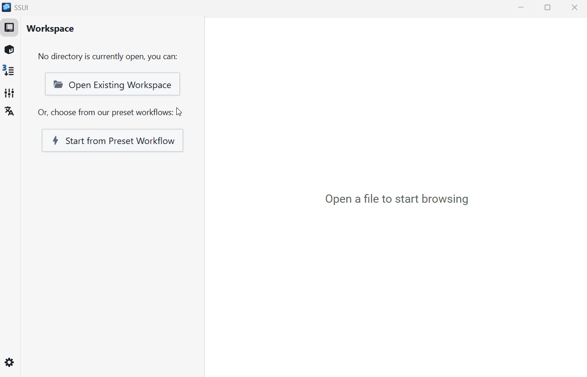
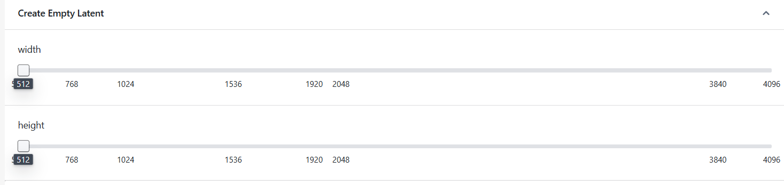

Stable Scripts UI
====================

 [English Readme](Readme.md)

Stable Scripts UI 是一个基于网页的用户界面，用于 `Stable Scripts` - 一种可以被其他用户轻松复现相同结果的 Python 脚本，用于运行生成式AI模型。


## 为什么选择 Stable Scripts？

与其他稳定扩散/生成式AI界面相比，SSUI 有 5 个主要优势：

- **易于使用**：快速创建、运行和分享稳定脚本，这些脚本是自包含的，可以自动下载必要的 Python 模块、AI 模型和其他依赖数据。
- **可复现**：脚本、依赖的模块和 SSUI 本身都是标记版本的。脚本可以在与脚本作者完全相同的环境中运行。
- **管理功能**：在一个集中的地方管理您的模型和配置。
- **强类型**：所有资源（包括模型）都是强类型的，可以防止被误用。
- **可定制**：您可以自定义脚本、类型、模型、面板、加载器、UI框架等。

### 项目管理

目前，大多数生成式AI工具都是基于节点的，这对于大规模工作流程来说并不友好。SSUI提供了一个项目管理系统，其中包含运行脚本所需的所有必要信息。

使用SSUI，您可以复制项目并与朋友分享。他们可以轻松地使用所有必要的资源重现结果。



### 模型管理

SSUI提供了一个模型管理系统，可以帮助您轻松地从Civitai、HuggingFace和本地文件下载和安装模型。


### 更好的集成

Stable Scripts提供了良好的集成能力，可以让您在不同场景中使用。一旦编写了脚本，它可以通过以下方式调用：
1. 其他脚本
2. 在功能性UI中
3. 在画布中 - 如果函数的输入和输出包含图像
4. 在其他扩展中


### 开发者工具

我们提供了VSCode插件来帮助您编写Stable Scripts。您可以在VSCode内编辑代码并运行脚本。


## 如何编写Stable Scripts？

详细请参考[Stable Scripts](doc/StableScripts.md)文档。

目前支持的模型有：
- SD1
- SDXL
- Flux

一个Stable Script必须包含3个部分：

### 1. 引入必要的模块
```python
from ssui import workflow, Prompt, Image, Noise
from ssui_image.SD1 import SD1Model, SD1Clip, SD1Latent, SD1Lora, SD1Denoise, SD1LatentDecode, SD1IPAdapter
from ssui.config import SSUIConfig
from typing import List, Tuple
```

### 2. 定义配置对象
```python
config = SSUIConfig()
```

### 3. 定义工作流函数，包含所有必要的类型提示。这些类型提示将用于生成UI。
```python
@workflow
def txt2img(model: SD1Model, positive: Prompt, negative: Prompt) -> Image:
    positive, negative = SD1Clip(config("Prompt To Condition"), model, positive, negative)
    latent = SD1Latent(config("Create Empty Latent"))
    latent = SD1Denoise(config("Denoise"), model, latent, positive, negative)
    return SD1LatentDecode(config("Latent to Image"), latent)
```

配置对象将定义工作流中的每个步骤，您必须将其作为每个API调用的第一个参数传递：

```python
latent = SD1Latent(config("Create Empty Latent"))
```
如果有可配置的参数，这些控件将在UI的详细面板中生成。



## 设置开发环境

### 依赖项

首先，请检查您的设备上是否安装了以下依赖项。

- nodejs 和 yarn
  - 请从以下地址下载：https://nodejs.org/en/download
  - npm install --global yarn

- rustc 和 cargo
  - 请查看 https://www.rust-lang.org/tools/install


### Nodejs 和 Python 环境

以下命令将为您安装 yarn 包和 '.venv' 中的嵌入式 Python 环境以及必要的 Python 包。

```bash
yarn
```


### 运行开发服务器

要快速开始开发，您可以将桌面项目作为入口点运行：
```bash
yarn dev:desktop
```

或者为功能 UI 开发启动额外的热重载服务器：
```bash
yarn dev:desktop
yarn dev:functional_ui
```

或者您可以手动启动服务器、执行器、功能 UI 和桌面，这样可以给您更多的灵活性和清晰的消息：

```bash
yarn dev:server
yarn dev:executor
yarn dev:functional_ui
yarn dev:desktop
```

- 应用服务器：http://localhost:7422/
- API 文档服务器：http://localhost:7422/docs
- 功能 UI 开发服务器：http://localhost:7420/

### 不使用桌面项目运行示例

如果您正在开发功能 UI，您可以直接从网页浏览器运行它：

```bash
yarn dev:server
yarn dev:executor
yarn dev:functional_ui
```

示例 URL：
```
http://localhost:7420/?path=<example_path>/basic/workflow-sd1.py
```

### 下载测试模型

要测试图像生成，您需要以下模型，包括：

- SD1.5
- SDXL
- Flux

您可以从以下地址下载：
https://huggingface.co/datasets/sunxfancy/TestModels/tree/main 


### 使用 Git Hooks 检查代码

我们推荐使用 [pre-commit](https://git-scm.com/book/ms/v2/Customizing-Git-Git-Hooks) 在提交前检查代码。

```bash
git config --local core.hooksPath .githooks/
```