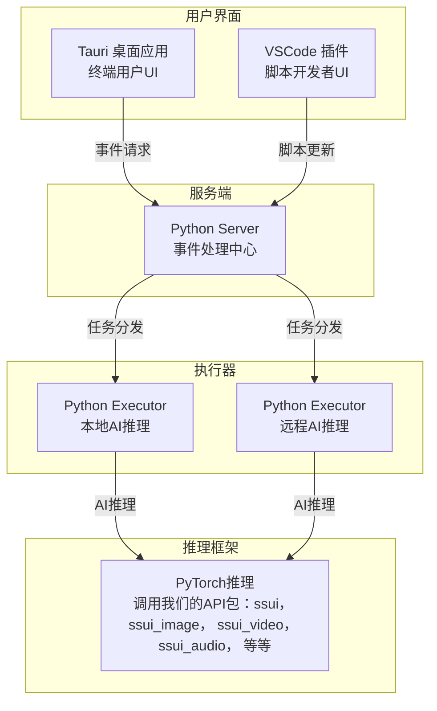

项目架构
=================

我们的整体架构是基于Tauri开发桌面应用UI，VSCode插件作为脚本开发者UI，均连接Tauri管理下的Python Server作为事件处理中心，而Python Executor作为分布式的任务执行器调用我们的Python包中API运行AI推理。

```mermaid
graph TB
    subgraph 用户界面
        Tauri[Tauri 桌面应用<br/>终端用户UI]
        VSCode[VSCode 插件<br/>脚本开发者UI]
    end
    
    subgraph 服务端
        Server[Python Server<br/>事件处理中心]
    end
    
    subgraph 执行器
        LocalExecutor[Python Executor<br/>本地AI推理]
        RemoteExecutor[Python Executor<br/>远程AI推理]
    end

    subgraph 推理框架
        PyTorch[PyTorch推理<br/>调用我们的API包：ssui， ssui_image， ssui_video， ssui_audio， 等等]
    end
    
    Tauri -->|事件请求| Server
    VSCode -->|脚本更新| Server
    
    Server -->|任务分发| LocalExecutor
    Server -->|任务分发| RemoteExecutor
    
    LocalExecutor -->|AI推理| PyTorch
    RemoteExecutor -->|AI推理| PyTorch
```

