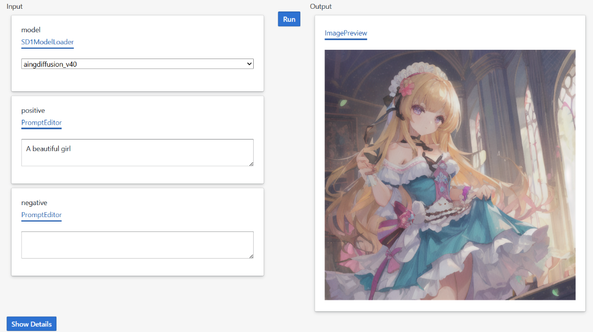
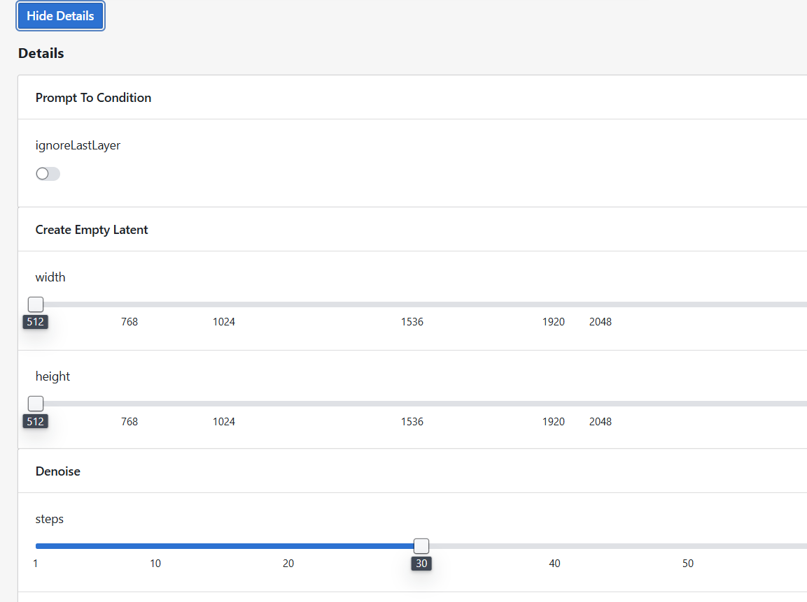

# 关于StableScripts

Stable Scripts是一种用于Stable Diffusion的Python脚本，它屏蔽了危险的API调用，可以安全地在网络上分享，并稳定复现另一个用户的工作。

## 为什么要用Python脚本？

相比于传统的Node-based Stable Diffusion UI，Stable Scripts有以下优势：

- 良好的抽象能力，可以用较短的代码实现复杂的工作流
- 高复用性，一个脚本中的函数可以被其他脚本调用
- 更强大的类型系统，脚本函数必须包含类型定义，利用了Python的类型系统，使得继承、多态成为可能

相比于直接使用Python API，Stable Scripts有以下优势：

- 更安全，Stable Scripts屏蔽了危险的API调用，从网络上下载的脚本可以更安全地运行在本地
- 更稳定，Stable Scripts的脚本必须在明确定义的项目中使用，用户在分享脚本时，所有依赖的模型、配置、参数信息都会一起打包，如果用户用到了自定义的资源，也会一起打包，确保另一个用户可以稳定复现另一个用户的工作


## 如何编写一个Stable Scripts？

从示例入手，您可以参考[examples](../examples/basic/) 目录下的脚本，了解如何编写一个Stable Scripts。

目录结构如下：

```
examples/basic/
├── workflow-sd1.py
├── workflow-sdxl.py
├── workflow-flux.py
├── ssproject.yaml
```

Stable Scripts脚本必须定义在一个项目下，项目根目录下必须包含`ssproject.yaml`文件，用于定义项目信息。

`ssproject.yaml`文件内容如下：

```yaml
ssui_version: 0.1.0
dependencies:
    - <package_name> = <version>
```
如果有用到第三方python依赖包，必须在此文件中声明，否则无法引用。

编写一个workflow-xx.py文件，来定义Stable Scripts的工作流。

```python
from ssui import workflow, Prompt, Image, Noise
from ssui.config import SSUIConfig
from ssui_image.SD1 import SD1Model, SD1Clip, SD1Latent, SD1Denoise, SD1LatentDecode

config = SSUIConfig()

@workflow
def txt2img(model: SD1Model, positive: Prompt, negative: Prompt) -> Image:
    positive, negative = SD1Clip(config("Prompt To Condition"), model, positive, negative)
    latent = SD1Latent(config("Create Empty Latent"))
    latent = SD1Denoise(config("Denoise"), model, latent, positive, negative)
    return SD1LatentDecode(config("Latent to Image"), model, latent)
```

这个脚本引入了ssui库，ssui_image库，用于定义Stable Scripts的配置。

如果一个函数被定义为`@workflow`，那么这个函数就是一个工作流的入口函数，可以显示在UI上。比如上面这个函数，接受一个SD1Model，两个Prompt，返回一个Image。那么在UI就会有如下显示：




我们的UI系统中，所有UI控件都是根据函数的参数和返回值类型自动生成的。


## 配置系统

显然，并不是所有的参数都是要作为函数参数传入的，很多配置非常复杂，如果全部作为参数则界面会非常臃肿。我们提供了一套配置系统，用于管理配置。您可能已经注意到了，在上面的示例代码中，我们有一个全局变量`config`，用于管理配置。

```python
config = SSUIConfig()
```

这个配置会在你点击'Show Details'时显示这个工作流的详细配置。

我们要求，每个函数调用，都需要指定当前调用所使用的配置组，如：

```python
SD1Clip(config("Prompt To Condition"), model, positive, negative)
```
这里，就会在UI上显示一个配置组，名称为`Prompt To Condition`，所有关于这个API的调用的配置都会显示在这个配置组中。





